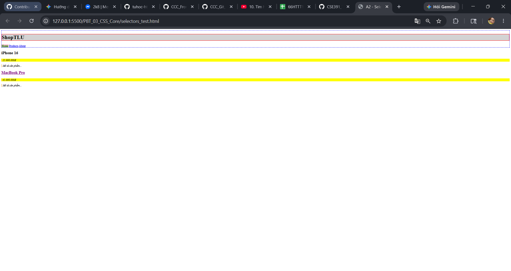
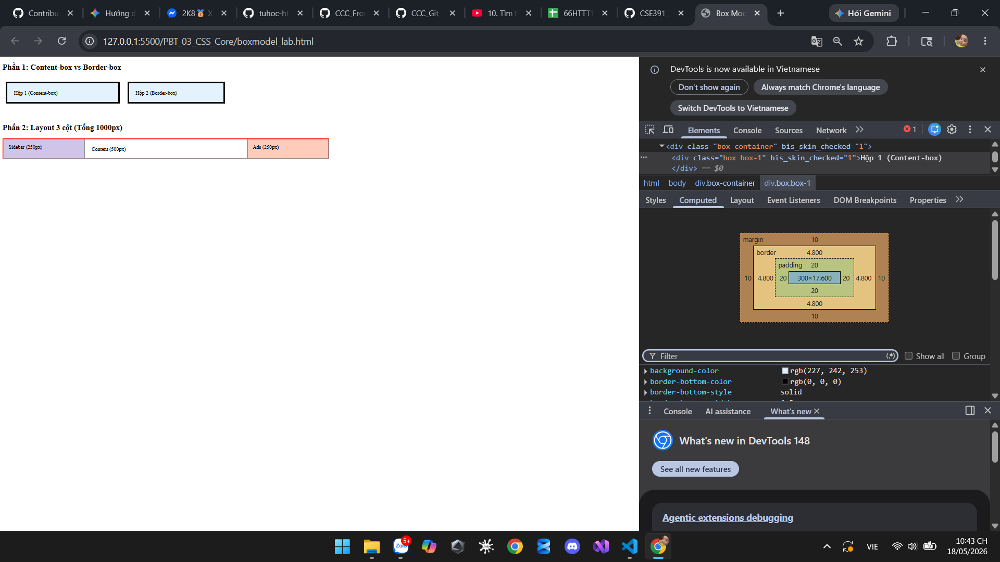
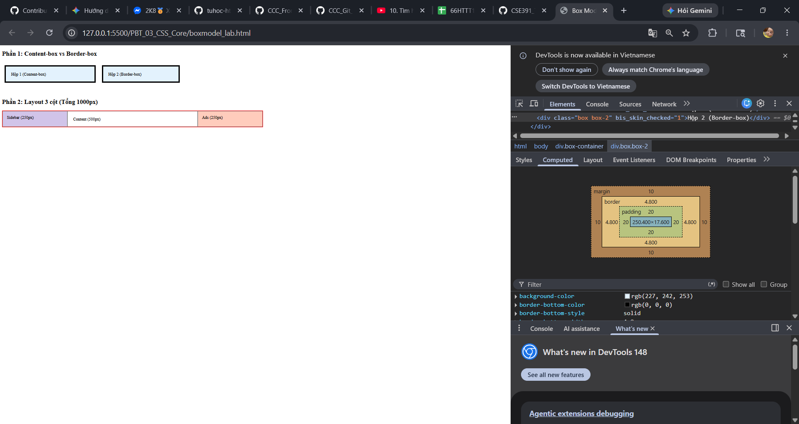

## PHẦN A — KIỂM TRA ĐỌC HIỂU

### Câu A1 — 3 Cách nhúng CSS

**1. Inline CSS (Nhúng trực tiếp vào thẻ)**

- **Ví dụ:** `<p style="color: red;">Văn bản</p>`
- **Ưu điểm:** Tác dụng nhanh, độ ưu tiên (specificity) rất cao, ghi đè được hầu hết các rule khác.
- **Nhược điểm:** Làm rối mã HTML, không thể tái sử dụng, cực kỳ khó bảo trì nếu dự án lớn.
- **Khi nào nên dùng:** Khi test code nhanh hoặc khi dùng JavaScript để thay đổi style động trực tiếp trên phần tử.

**2. Internal CSS (Nhúng trong thẻ style)**

- **Ví dụ:** ```html
  <style>
      p { color: blue; }
  </style>

  ```

  ```

- **Ưu điểm:** Gọn gàng trong một file HTML, không cần trình duyệt gửi thêm HTTP request để tải file CSS.
- **Nhược điểm:** Không thể chia sẻ style này cho các trang HTML khác, làm file HTML dài và nặng hơn.
- **Khi nào nên dùng:** Cho các landing page đơn lẻ (chỉ có 1 trang), hoặc tạo template HTML cho email.

**3. External CSS (File CSS riêng biệt)**

- **Ví dụ:** `<link rel="stylesheet" href="style.css">`
- **Ưu điểm:** Tách biệt hoàn toàn HTML và CSS, dễ tái sử dụng cho nhiều trang, trình duyệt có thể cache (lưu tạm) file CSS giúp tải trang nhanh hơn ở các lần sau.
- **Nhược điểm:** Tốn thêm HTTP request ban đầu để tải file CSS về máy.
- **Khi nào nên dùng:** Phù hợp cho mọi dự án thực tế và chuyên nghiệp.

**=> Câu hỏi thêm:** Nếu cùng 1 element có cả 3 cách CSS đồng thời áp dụng, **Inline CSS** sẽ "thắng". Lý do là theo quy tắc tính độ ưu tiên (Specificity), Inline style có điểm số cao nhất (1,0,0,0), đè bẹp tất cả các khai báo từ ID, Class hay thẻ HTML trong Internal và External CSS.

### Câu A2 — Dự đoán kết quả CSS Selectors

1. `h1` → Chọn: **ShopTLU**
2. `.price` → Chọn: **25.990.000đ** và **45.990.000đ**
3. `#app header` → Chọn: **Toàn bộ khối `<header>`** (chứa tiêu đề ShopTLU và cụm Menu).
4. `nav a:first-child` → Chọn: **Home**
5. `.product.featured h2` → Chọn: **MacBook Pro**
6. `article > p` → Chọn: **25.990.000đ**, **Mô tả sản phẩm...** (của iPhone 16) VÀ **45.990.000đ**, **Mô tả sản phẩm...** (của MacBook Pro).
7. `a[href="/"]` → Chọn: **Home**
8. `.top-bar.dark h1` → Chọn: **ShopTLU**

_Ảnh chụp màn hình kiểm chứng:_


### Câu A3 — Tính toán Box Model

**Trường hợp 1: content-box (mặc định)**

- Chiều rộng hiển thị = 400 (content) + 40 (padding 2 bên) + 10 (border 2 bên) = **450px**
- Không gian chiếm trên trang = 450 + 20 (margin 2 bên) = **470px**

**Trường hợp 2: border-box**

- Chiều rộng hiển thị = **400px** (Giữ nguyên theo thuộc tính width)
- Kích thước content thực tế = 400 - 40 (padding) - 10 (border) = **350px**
- Không gian chiếm trên trang = 400 + 20 (margin) = **420px**

**Trường hợp 3: Margin collapse**

- Khoảng cách giữa box-a và box-b = **40px**
- Giải thích: Khi 2 khối block nằm xếp dọc cạnh nhau, margin-bottom của khối trên và margin-top của khối dưới sẽ bị gộp (collapse). Trình duyệt lấy giá trị lớn hơn (giữa 25px và 40px) thay vì cộng dồn chúng.

**Nâng cao:** Khoảng cách = 40 + (-10) = **30px** (Cộng đại số).

### Câu A4 — Specificity (Độ ưu tiên)

1. Tính specificity score:
   - Rule A (`p`): **0,0,1** (1 Thẻ)
   - Rule B (`.price`): **0,1,0** (1 Class)
   - Rule C (`#main-price`): **1,0,0** (1 ID)
   - Rule D (`p.price`): **0,1,1** (1 Class, 1 Thẻ)
2. Element sẽ có màu **đỏ (red)**. Vì Rule C dùng ID selector nên có điểm Specificity cao nhất (1,0,0).
3. Nếu thêm style inline, element có màu **cam (orange)**. Điểm của inline style là 1,0,0,0, cao hơn mọi ID hay Class.
4. Nếu Rule A thêm `!important`, element có màu **đen (black)**. Từ khóa `!important` có quyền lực tuyệt đối, ghi đè mọi hệ thống tính điểm thông thường.

---

## PHẦN B — THỰC HÀNH CODE (Giải thích)

### Bài B2 — Box Model Lab

**Phần 1 — Chứng minh content-box vs border-box:**

- Hộp 1 (content-box): chiều rộng thực tế = **350px** (Lấy 300px cộng thêm padding và border).
- Hộp 2 (border-box): chiều rộng thực tế = **300px** (Kích thước bị ép cứng, padding và border lấn ngược vào trong làm hẹp phần content).
- _Giải thích sự khác biệt:_ `box-sizing: border-box` giúp kiểm soát kích thước tổng thể dễ dàng hơn, không bị phình to ra khi thêm padding hoặc border giống như `content-box` mặc định.

_Ảnh chụp DevTools Box Model:_



### Bài B3 — Specificity Battle

**1. Liệt kê 10 rules + specificity score:**

1. `* { color: black; }` (0,0,0)
2. `p { color: gray; }` (0,0,1)
3. `.text { color: yellow; }` (0,1,0)
4. `.text.highlight { color: orange; }` (0,2,0)
5. `p.text.highlight { color: pink; }` (0,2,1)
6. `#demo { color: blue; }` (1,0,0)
7. `p#demo { color: purple; }` (1,0,1)
8. `#demo.text { color: brown; }` (1,1,0)
9. `#demo.text.highlight { color: red; }` (1,2,0)
10. `p#demo.text.highlight { color: green; }` (1,2,1)

**2. Element cuối cùng hiển thị màu gì? Tại sao?**
Element hiển thị màu **green**. Lý do: Rule thứ 10 mang tính đặc thù cao nhất do kết hợp đầy đủ 1 ID + 2 Class + 1 Thẻ, mang lại điểm số cao nhất (1,2,1).

**3. Thay đổi thứ tự rules trong CSS file. Kết quả có đổi không? Giải thích.**
Kết quả **không thay đổi**. Vì quy tắc Specificity đánh giá dựa trên bản chất cấu tạo của selector, không phụ thuộc vào vị trí dòng lệnh trên hay dưới (thứ tự dòng chỉ được tính đến nếu 2 rule có điểm Specificity bằng nhau y hệt).

---

## PHẦN C — DEBUG & SUY LUẬN

### Câu C1 — Debug CSS Layout

1. **Tính chiều rộng thực tế (content-box):**
   - Sidebar = 300 (width) + 40 (padding) + 2 (border) = **342px**
   - Content = 660 (width) + 60 (padding) + 2 (border) = **722px**
2. **Tại sao layout bị vỡ:**
   Tổng chiều rộng thực tế khi hiển thị của 2 khối là: 342 + 722 = **1064px**. Con số này lớn hơn chiều rộng của khối container mẹ (960px). Do vượt quá giới hạn khung chứa, cột content bị rớt xuống dòng mới.
3. **2 cách sửa:**
   - **Cách 1 (Dùng border-box):** Thêm `box-sizing: border-box;` vào cả class `.sidebar` và `.content` để chúng không bị phình ra.
   - **Cách 2 (Tính toán thủ công):** Giữ nguyên `.sidebar`, giảm width của `.content` xuống `556px` (Cách tính: 960 - 342 - 60 padding - 2 border = 556).

### Câu C2 — Cascade Puzzle

1. **"Sản phẩm A" (h2):** - `font-size`: **20px** (Lấy từ rule `.card .title`).
   - `color`: **green** (Lấy từ class `.highlight` do có `!important`, đè được cả ID `#featured`).
2. **"Mô tả sản phẩm" (p trong card featured):**
   - `color`: **blue** (Thẻ p được định nghĩa `color: inherit`, nên nó kế thừa màu xanh dương từ thẻ cha là `.card`).
3. **"Sản phẩm B" (h2):**
   - `font-size`: **20px** (Lấy từ rule `.card .title`).
   - `color`: **blue** (Kế thừa từ thẻ `.card`. Do element này không có ID và class highlight).
4. **"Mô tả sản phẩm B" (p.highlight):**
   - `color`: **green** (Mặc dù có rule kế thừa `color: inherit` nằm ở cấu hình chung thẻ p, nhưng class `.highlight` mang cờ `!important` ưu tiên tuyệt đối nên đã giành lại quyền set màu).
